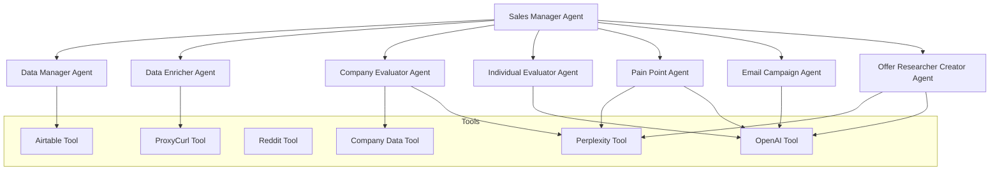

# Sales Team AI Agents

An AI-powered sales automation system that leverages multiple AI agents to automate and enhance the sales process, with seamless Airtable integration for lead management.

## Overview

This project implements an advanced AI-driven sales automation system using CrewAI, a framework for orchestrating multiple AI agents. The system employs a hierarchical structure with a Sales Manager agent overseeing specialized task-specific agents, all working in coordination to automate and optimize the sales process.

### Key Features

- **Multi-Agent System**: Utilizes specialized AI agents working in coordination
- **Lead Analysis**: Comprehensive evaluation of leads based on company and individual data
- **Pain Point Analysis**: Automated identification of potential customer pain points
- **Email Campaign Generation**: Customized email campaign content creation
- **Data Integration**: Seamless integration with Airtable for lead management
- **Multiple Data Sources**: Leverages various tools including ProxyCurl, Reddit, and company data APIs

## System Architecture

### CrewAI Integration

The system is built on CrewAI, which provides a robust framework for creating and managing AI agent crews. Key CrewAI components used include:

1. **Agents**: Each agent is a specialized AI entity with defined roles, goals, and backstories
2. **Tasks**: Structured units of work assigned to specific agents
3. **Process**: Sequential or parallel execution of tasks
4. **Tools**: Specialized capabilities provided to agents

### Agent Hierarchy



### Agent Roles and Responsibilities

1. **Sales Manager Agent**
   - Role: Orchestrates the entire sales process
   - Responsibilities:
     - Task delegation and prioritization
     - Process monitoring and optimization
     - Resource allocation
     - Decision making based on agent outputs

2. **Data Manager Agent**
   - Role: Manages data storage and retrieval
   - Key Tasks:
     - Lead data storage in Airtable
     - Data validation and cleaning
     - Record updates and maintenance
     - Data synchronization across tools

3. **Data Enricher Agent**
   - Role: Enriches lead data with additional information
   - Key Tasks:
     - LinkedIn profile data retrieval
     - Company information enrichment
     - Contact information validation
     - Data standardization

4. **Company Evaluator Agent**
   - Purpose: Analyzes company profiles for market fit
   - Key Tasks:
     - Company data enrichment
     - Industry analysis
     - Market fit scoring
     - Technology stack evaluation

5. **Individual Evaluator Agent**
   - Purpose: Assesses individual lead characteristics
   - Key Tasks:
     - Professional background analysis
     - Role relevance evaluation
     - Decision-making authority assessment
     - Communication preference analysis

6. **Pain Point Agent**
   - Purpose: Identifies potential customer pain points
   - Key Tasks:
     - Industry research
     - Competitor analysis
     - Market trend analysis
     - Pain point prioritization

7. **Email Campaign Agent**
   - Purpose: Creates personalized email campaigns
   - Key Tasks:
     - Content generation
     - Personalization
     - A/B testing suggestions
     - Campaign sequencing

8. **Offer Researcher Creator Agent**
   - Purpose: Develops targeted solutions and offers
   - Key Tasks:
     - Solution research
     - Pricing analysis
     - Proposal generation
     - Value proposition creation

### Process Types

The system supports multiple process types through CrewAI:

1. **Sequential Process**
   ```python
   crew.kickoff(
       process=Process.sequential
   )
   ```
   - Tasks are executed in a predetermined order
   - Each agent waits for previous tasks to complete
   - Ideal for dependent workflows (e.g., company analysis → pain point identification → offer creation)

2. **Hierarchical Process**
   ```python
   crew.kickoff(
       process=Process.hierarchical
   )
   ```
   - Manager agent delegates and oversees tasks
   - Parallel execution of independent tasks
   - Dynamic task prioritization

3. **Parallel Process**
   ```python
   crew.kickoff(
       process=Process.parallel
   )
   ```
   - Simultaneous execution of independent tasks
   - Faster processing for large lead volumes
   - Resource-efficient for independent analyses

### Data Flow

The system follows a sophisticated data flow process:

1. **Data Ingestion**
   ```python
   # Lead data is ingested and initially processed
   crew.inputs['leads'] = leads_data
   ```

2. **Data Enrichment**
   - Data Manager creates initial records
   - Data Enricher enhances profiles with:
     - LinkedIn data via ProxyCurl
     - Company information
     - Additional contact details

3. **Analysis Pipeline**
   - Company and Individual evaluation
   - Pain point identification
   - Offer creation
   - Email campaign generation

4. **Data Storage**
   - All processed data is stored in Airtable
   - Structured for easy retrieval and updates
   - Maintains relationships between different data points

## Airtable Integration

### Overview
The system uses Airtable as its primary data store, with a sophisticated schema designed for lead management and email campaign tracking. The integration is handled through automated setup scripts and a dedicated Airtable tool.

### Base Structure

The Airtable base "AI Sales Agent Prospecting" consists of two main tables:

1. **Leads Table**
   ```
   ├── Basic Lead Info
   │   ├── Lead ID (Text)
   │   ├── Name (Text)
   │   ├── Email (Email)
   │   ├── Company (Text)
   │   ├── Role (Text)
   │   ├── LinkedIn URL (URL)
   │   └── Company LinkedIn (URL)
   │
   ├── Evaluation Status
   │   ├── Individual Evaluation Status (Select)
   │   │   └── Options: Not Started, In Progress, Completed, Needs Review
   │   └── Company Evaluation Status (Select)
   │       └── Options: Not Started, In Progress, Completed, Needs Review
   │
   ├── Scoring Metrics
   │   ├── Individual Score (Number)
   │   ├── Company Score (Number)
   │   ├── Role Match Score (Number)
   │   ├── Authority Match Score (Number)
   │   ├── Department Match Score (Number)
   │   ├── Skills Match Score (Number)
   │   ├── Industry Match Score (Number)
   │   ├── Size Match Score (Number)
   │   ├── Location Match Score (Number)
   │   └── Growth Match Score (Number)
   │
   └── Analysis Data
       ├── Individual Analysis (Long Text)
       ├── Company Analysis (Long Text)
       ├── Enriched Individual Data (Long Text)
       ├── Enriched Company Data (Long Text)
       ├── Raw Data (Long Text)
       └── Proxycurl Result (Long Text)
   ```

2. **Email Campaigns Table**
   ```
   ├── Campaign Info
   │   ├── Lead ID (Text)
   │   ├── Email Subject (Text)
   │   ├── Email Body (Long Text)
   │   └── Sequence Number (Number)
   │
   └── Campaign Details
       ├── Wait Days (Number)
       ├── Personalization Notes (Long Text)
       ├── Pain Points Addressed (Long Text)
       └── Call To Action (Text)
   ```

### Setup and Configuration

1. **Initial Setup**
   ```bash
   # Initialize Airtable base with schema
   python setup/airtable_initialization.py
   
   # Force recreation of base
   python setup/airtable_initialization.py --force
   ```

2. **Environment Variables**
   ```env
   AI_AGENT_AIRTABLE_API_KEY=your_api_key
   AIRTABLE_BASE_ID=your_base_id
   AIRTABLE_WORKSPACE_ID=your_workspace_id
   ```

3. **Schema Management**
   - The schema is defined in `setup/config/airtable_config.py`
   - Includes table definitions, field types, and select options
   - Automated schema updates via initialization script

### Data Flow

1. **Lead Creation**
   ```python
   # Example of lead data structure
   lead_data = {
       "Lead ID": "L001",
       "Name": "John Doe",
       "Email": "john.doe@example.com",
       "Company": "Example Corp",
       "Individual Evaluation Status": "Not Started",
       "Company Evaluation Status": "Not Started"
   }
   ```

2. **Status Tracking**
   - Individual and Company evaluation statuses
   - Color-coded status indicators:
     - Not Started: Red
     - In Progress: Yellow
     - Completed: Green
     - Needs Review: Orange

3. **Scoring System**
   - Numerical scores (0-10) for various metrics
   - Automated calculation based on agent evaluations
   - Tier classification (High/Medium/Low) based on aggregate scores

### Integration with Agents

The Data Manager Agent interacts with Airtable through the AirtableTool, which provides:
- Record creation and updates
- Data validation
- Status management
- Score calculations
- Campaign tracking

```python
# Example of agent interaction with Airtable
from getting_automated_sales_ai_agent.tools import AirtableTool

airtable_tool = AirtableTool(llm=self.llm)
result = airtable_tool.create_or_update_lead(
    lead_data,
    evaluation_status="In Progress"
)
```

## Setup

### Prerequisites
- Python 3.8+
- Airtable account with workspace creator permissions
- API access to various services (OpenAI, Perplexity, ProxyCurl, etc.)

### Environment Variables
Create a `.env` file in the root directory with the following:

```env
AIRTABLE_API_KEY=your_personal_access_token
AIRTABLE_BASE_ID=your_base_id
OPENAI_API_KEY=your_openai_api_key
PERPLEXITY_API_KEY=your_perplexity_api_key
PROXYCURL_API_KEY=your_proxycurl_api_key
REDDIT_CLIENT_ID=your_reddit_client_id
REDDIT_CLIENT_SECRET=your_reddit_client_secret
REDDIT_USER_AGENT=your_reddit_user_agent
REDDIT_USERNAME=your_reddit_username
REDDIT_PASSWORD=your_reddit_password
```

### Installation

1. Clone the repository:
```bash
git clone [repository-url]
cd sales-team-ai-agents
```

2. Install dependencies:
```bash
pip install -r requirements.txt
```

## Usage

### Processing Leads

The system can process leads from CSV files containing lead information. The CSV should include fields such as:
- First Name, Last Name
- Company
- LinkedIn URLs (Person and Company)
- Role/Title
- Industry
- Company Website
- Contact Information
- Company Details

### Running the System

```python
from getting_automated_sales_ai_agent.crew import GettingAutomatedSalesAiAgent

# Initialize the crew
crew = GettingAutomatedSalesAiAgent()

# Process leads
crew.inputs['leads'] = your_leads_data
result = crew.run()
```

## Configuration

The system uses YAML configuration files located in the config directory:
- `agents.yaml`: Defines agent roles, goals, and behaviors
- `config.yaml`: Contains ICP (Ideal Customer Profile) configuration

## Directory Structure

```
sales-team-ai-agents/
├── getting_automated_sales_ai_agent/
│   └── src/
│       └── getting_automated_sales_ai_agent/
│           ├── agents/
│           │   ├── company_evaluator.py
│           │   ├── email_campaign_agent.py
│           │   ├── individual_evaluator.py
│           │   ├── offer_researcher_creator_agent.py
│           │   └── pain_point_agent.py
│           ├── tools/
│           ├── config/
│           ├── main.py
│           └── crew.py
└── setup/
    └── config/
```

## Contributing

Contributions are welcome! Please feel free to submit a Pull Request.

## License

[Specify your license here]

## Support

For support, please [specify contact method or raise an issue in the repository].